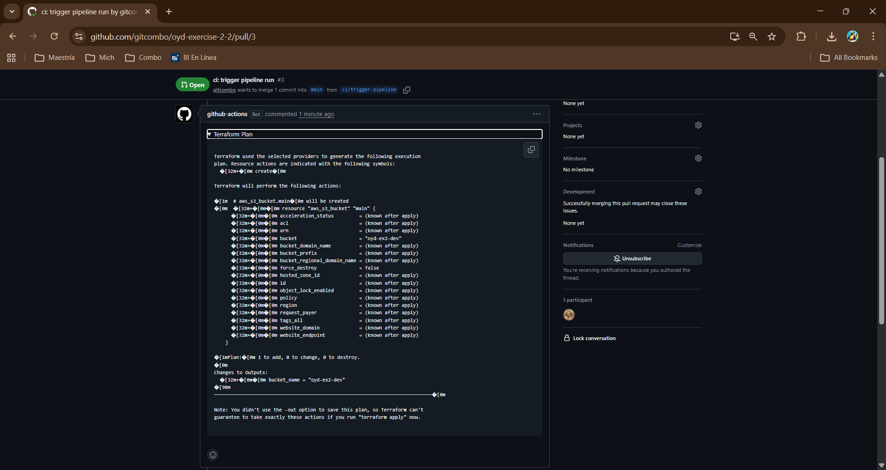

# oyd-exercise-2-2

GitHub Actions CI pipeline that validates and plans a Terraform workspace on every pull request targeting `main`.

## Pipeline Overview

| Step | Action |
|------|--------|
| `terraform fmt --check` | Fails the PR if any `.tf` file is not formatted |
| `terraform init -backend=false` | Initialises providers without a remote backend |
| `terraform validate` | Checks configuration correctness |
| `terraform plan` | Generates an execution plan using `envs/dev/dev.tfvars` |
| Post PR comment | Attaches the full plan output as a collapsible comment |

## Repository Secrets Required

| Secret | Description |
|--------|-------------|
| `AWS_ACCESS_KEY_ID` | AWS access key |
| `AWS_SECRET_ACCESS_KEY` | AWS secret key |
| `AWS_REGION` | Target AWS region |

## Evidence

<!-- Replace the URL below with the actual PR link once the pipeline has run -->
- Pull Request: [PR #1 — trigger CI pipeline](https://github.com/gitcombo/oyd-exercise-2-2/pull/3)

